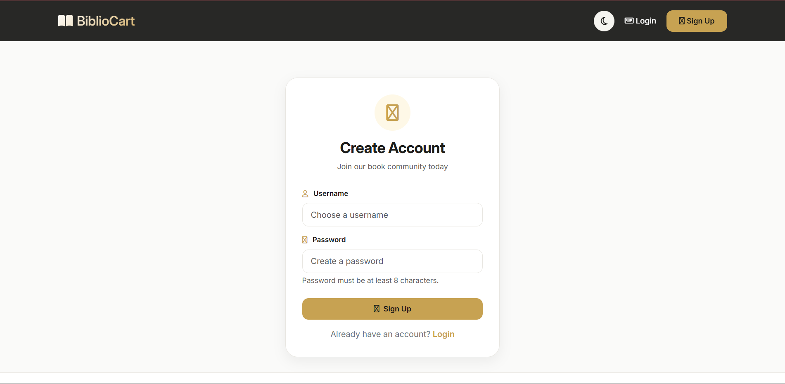
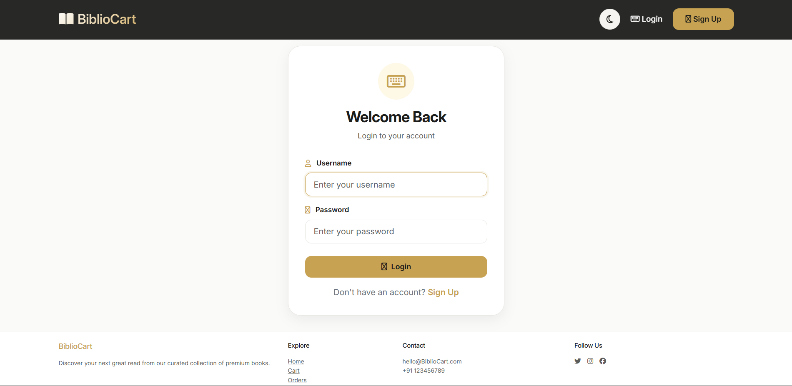
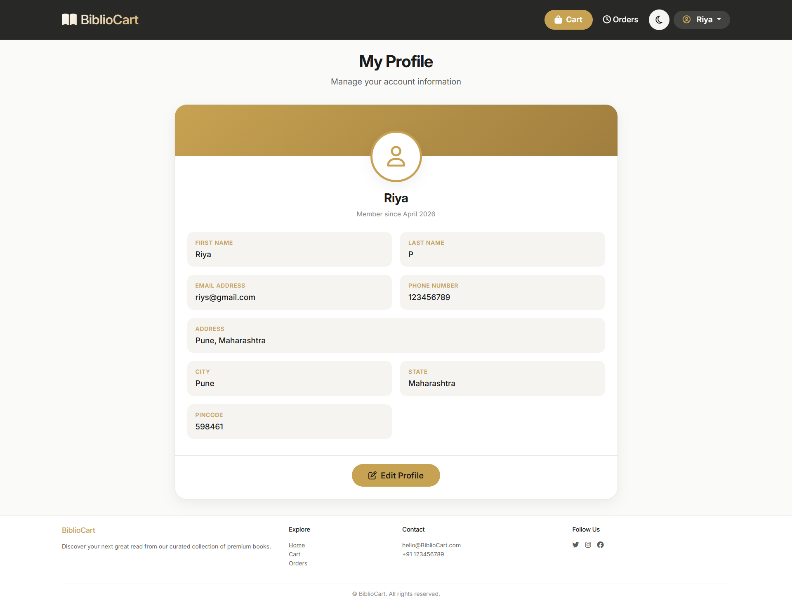
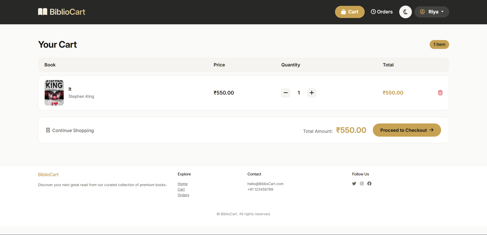
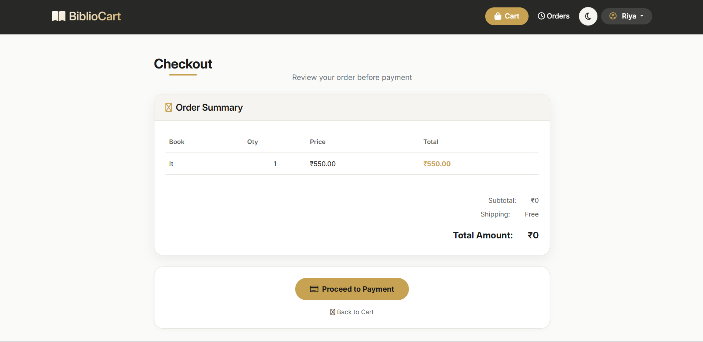
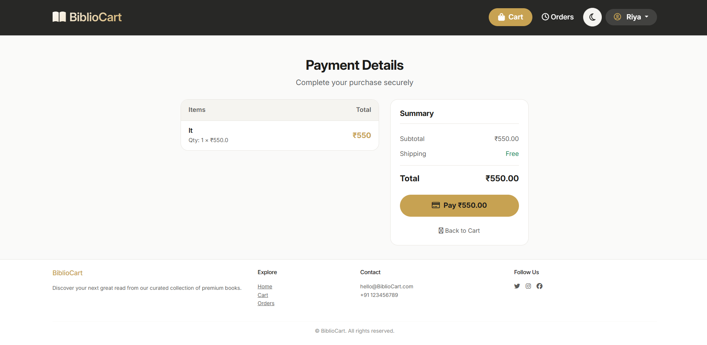
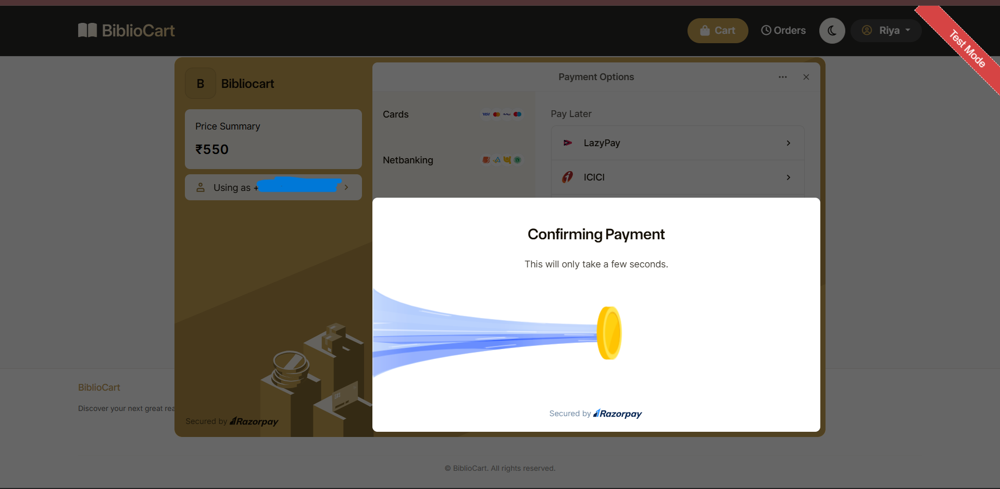
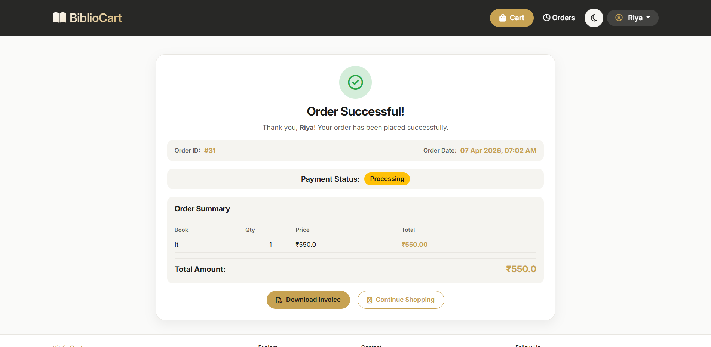
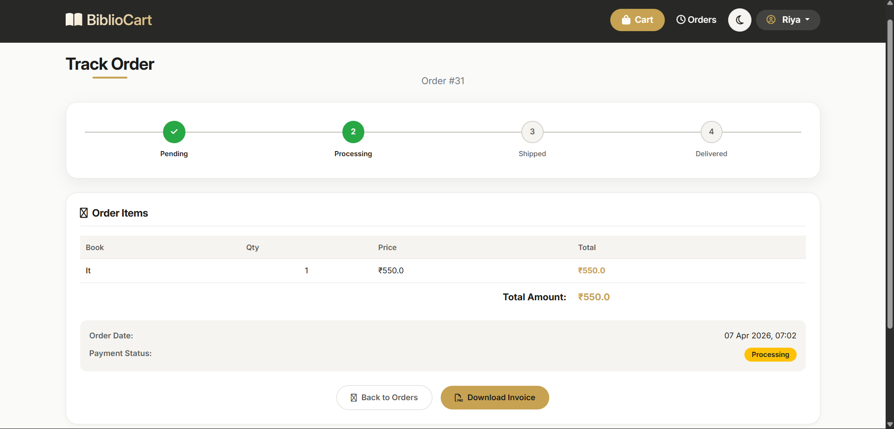
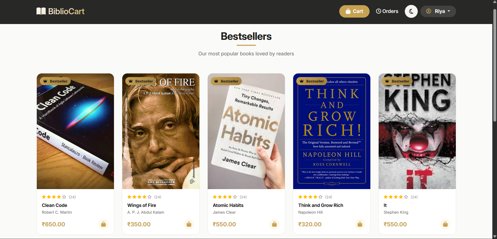

<div align="center">

# 📚 BiblioCart

### A Full-Stack Django E-Commerce Platform for Books

[](https://python.org)
[](https://djangoproject.com)
[](https://www.django-rest-framework.org/)
[](https://getbootstrap.com)
[](https://razorpay.com)
[](https://sqlite.org)
[](#)
[](#)
[](LICENSE)
[](#)

<br/>

> BiblioCart is a full-stack e-commerce web application for buying books online.  
> Browse books, save to wishlist, manage your cart, pay securely, track every order — and get smart book recommendations powered by AI.  
> Now with a fully documented **REST API** and an **AI-powered chatbot assistant**.

<br/>

[Overview](#-overview) · [Features](#-features) · [Tech Stack](#-tech-stack) · [Architecture](#-architecture) · [REST API](#-rest-api) · [Recommendations](#-smart-recommendations) · [Chatbot](#-ai-chatbot-assistant) · [Installation](#-installation) · [Project Structure](#-project-structure) · [Screenshots](#-screenshots) · [Future Improvements](#-future-improvements) · [Author](#-author)

</div>

---

## 🧭 Overview

BiblioCart is a real-world e-commerce platform built with Django, targeting book lovers and readers. It implements a complete end-to-end purchase workflow — from browsing and searching books to placing an order and tracking its delivery status.

This project demonstrates practical full-stack development skills including backend architecture, payment gateway integration, order lifecycle management, a REST API layer, smart recommendation algorithms, and an AI-powered chatbot — all wrapped in a responsive, user-friendly interface.

---

## ✨ Features

### 🔐 Authentication
- User registration, login, and logout
- Session-based secure access for web views
- **JWT-based authentication** for REST API consumers
- User-specific data isolation (orders, cart, wishlist, history)

### 📖 Books & Browsing
- Browse the full book catalog
- Search books by title, author, or category
- Detailed book view with description and pricing
- Curated bestsellers listing
- Paginated book listings for better performance and UX
- Wishlist to save favourite books for later

### 🛒 Cart Management
- Add books to the cart and update quantities
- Remove items individually
- Real-time cart summary with price calculation via custom template filters

### 💳 Checkout & Payments
- Streamlined checkout flow
- **Razorpay integration** (test mode) for secure payment processing
- Order creation and storage on successful payment

### 📦 Order Management
- Order history dashboard per user
- Detailed order view with itemized summary
- Order tracking with visual status progression:

  ```
  Pending → Processing → Shipped → Completed
                                 ↘ Cancelled
  ```

### 🧾 Invoice
- Invoice download for completed orders

### 🤖 Smart Recommendations
- **Personalised recommendations** based on the user's order history and category preferences
- **"Customers Also Bought"** — collaborative filtering based on co-purchase patterns
- **Trending books** — ranked by total order volume across all users
- Guest fallback: bestsellers and new arrivals shown to unauthenticated users

### 💬 AI Chatbot Assistant
- Conversational book assistant powered by **Google Gemini 2.5 Flash**
- Intent detection for common queries (greetings, price queries, recommendations, similar books)
- Session-based short-term memory (last 5 messages) for context-aware responses
- Database-backed search by title, author, or category before invoking the AI
- Graceful AI fallback for open-ended or unmatched queries
- Strict scope enforcement — only responds to book-related questions

### 🌐 REST API
- Full API layer built with Django REST Framework
- JWT authentication via `djangorestframework-simplejwt`
- Endpoints for books, cart, wishlist, orders, checkout, and payment verification
- Advanced filtering, search, and ordering on book listings
- See the [REST API](#-rest-api) section for the full endpoint reference

### 📱 Responsive UI
- Built with Bootstrap 5
- Mobile-friendly layout across all pages

---

## 🛠 Tech Stack

| Layer | Technology |
|---|---|
| **Backend** | Python, Django |
| **REST API** | Django REST Framework, SimpleJWT |
| **Frontend** | HTML5, CSS3, Bootstrap 5, JavaScript |
| **Database** | SQLite (default) · MySQL (configurable) |
| **Payment** | Razorpay (Test Mode) |
| **Auth (API)** | JWT (djangorestframework-simplejwt) |
| **AI Chatbot** | Google Gemini 2.5 Flash (`google-generativeai`) |
| **Filtering** | django-filter |
| **Version Control** | Git & GitHub |

---

## 🏗 Architecture

BiblioCart follows Django's modular app pattern for clean separation of concerns:

```
bibliocart/
│
├── books/          # Book catalog, browsing, search
├── cart/           # Cart logic, session management
├── orders/         # Order creation, tracking, history
├── users/          # Authentication, profile
├── wishlist/       # Wishlist management
├── api/            # REST API — views, serializers, URLs, filters
├── chatbot/        # AI chatbot — intent detection, Gemini integration
│
├── templates/      # HTML templates (per-app + shared base)
├── static/         # CSS, JS, images
├── media/          # Uploaded book covers
│
├── bibliocart/     # Project settings, URLs, WSGI
└── manage.py
```

**Key architectural decisions:**
- Django ORM for all database interactions — no raw SQL
- Template-based rendering for clean server-side HTML
- Custom template filters for dynamic price calculations (e.g., `quantity × price`)
- User-scoped querysets to prevent unauthorized order access
- Razorpay's JS SDK integrated at the frontend, verified server-side
- REST API layer in a dedicated `api/` app — clean separation from web views
- JWT tokens for stateless API authentication
- Collaborative filtering for "Customers Also Bought" recommendations
- Chatbot uses rule-based intent detection first; Gemini AI is invoked only as a fallback

---

## 🌐 REST API

BiblioCart exposes a REST API for programmatic access to all core features. All API endpoints are prefixed with `/api/`.

### Authentication

The API uses **JWT (JSON Web Tokens)**. Obtain a token pair via the login endpoint and include the access token in subsequent requests:

```
Authorization: Bearer <access_token>
```

---

### 📘 Endpoint Reference

#### Auth

| Method | Endpoint | Auth | Description |
|--------|----------|------|-------------|
| `POST` | `/api/register/` | Public | Register a new user |
| `POST` | `/api/login/` | Public | Login and receive JWT token pair |

**Register — Request Body:**
```json
{
  "username": "samiksha",
  "email": "samiksha@example.com",
  "password": "yourpassword"
}
```

**Login — Response:**
```json
{
  "access": "<access_token>",
  "refresh": "<refresh_token>"
}
```

---

#### 📖 Books

| Method | Endpoint | Auth | Description |
|--------|----------|------|-------------|
| `GET` | `/api/books/` | Public | List all books |
| `GET` | `/api/books/<id>/` | Public | Retrieve a single book |
| `GET` | `/api/recommended/` | Public* | Personalised recommendations |
| `GET` | `/api/also-bought/<book_id>/` | Public | "Customers Also Bought" |
| `GET` | `/api/trending/` | Public | Trending books by order count |

\* Returns personalised results for authenticated users; bestsellers/new arrivals for guests.

**Filtering & Search on `/api/books/`:**

| Parameter | Example | Description |
|-----------|---------|-------------|
| `search` | `?search=python` | Search by title, author, or category |
| `ordering` | `?ordering=price` | Sort by `price` or `created_at` (prefix `-` for descending) |
| Category filter | `?category=1` | Filter by category ID (via `django-filter`) |

---

#### 🛒 Cart

| Method | Endpoint | Auth | Description |
|--------|----------|------|-------------|
| `GET` | `/api/cart/` | Required | View current cart |
| `POST` | `/api/cart/add/` | Required | Add a book to cart |
| `PUT` | `/api/cart/update/<item_id>/` | Required | Update item quantity |
| `DELETE` | `/api/cart/remove/<item_id>/` | Required | Remove an item from cart |

**Add to Cart — Request Body:**
```json
{
  "book": 3,
  "quantity": 2
}
```

---

#### ❤️ Wishlist

| Method | Endpoint | Auth | Description |
|--------|----------|------|-------------|
| `GET` | `/api/wishlist/` | Required | View wishlist |
| `POST` | `/api/wishlist/add/` | Required | Add a book to wishlist |
| `DELETE` | `/api/wishlist/remove/<item_id>/` | Required | Remove a book from wishlist |

---

#### 💳 Checkout & Payment

| Method | Endpoint | Auth | Description |
|--------|----------|------|-------------|
| `POST` | `/api/checkout/` | Required | Create a Razorpay order from cart |
| `POST` | `/api/verify-payment/` | Public | Verify Razorpay payment and confirm order |

**Checkout — Response:**
```json
{
  "order_id": 12,
  "razorpay_order_id": "order_XXXXXXXX",
  "amount": 799.00
}
```

**Verify Payment — Request Body:**
```json
{
  "razorpay_order_id": "order_XXXXXXXX",
  "razorpay_payment_id": "pay_XXXXXXXX"
}
```

---

#### 📦 Orders

| Method | Endpoint | Auth | Description |
|--------|----------|------|-------------|
| `GET` | `/api/my-orders/` | Required | List all orders for the logged-in user |

---

#### 💬 Chatbot

| Method | Endpoint | Auth | Description |
|--------|----------|------|-------------|
| `POST` | `/api/chat/` | Public | Send a message to the AI assistant |

**Request Body:**
```json
{
  "message": "Suggest some books on machine learning"
}
```

**Response:**
```json
{
  "reply": "📚 Found Books:\n\n📖 Hands-On Machine Learning - ₹499\n📖 Python Machine Learning - ₹399"
}
```

---

### Router-registered Endpoints (BookViewSet)

The `BookViewSet` is registered with DRF's `DefaultRouter`, providing the full set of standard REST endpoints automatically:

| Method | Endpoint | Description |
|--------|----------|-------------|
| `GET` | `/api/books/` | List all books |
| `POST` | `/api/books/` | Create a book (admin) |
| `GET` | `/api/books/<id>/` | Retrieve a book |
| `PUT` | `/api/books/<id>/` | Update a book (admin) |
| `PATCH` | `/api/books/<id>/` | Partial update (admin) |
| `DELETE` | `/api/books/<id>/` | Delete a book (admin) |

---

## 🧠 Smart Recommendations

BiblioCart uses multiple recommendation strategies to surface relevant books:

| Strategy | Logic | Shown To |
|---|---|---|
| **Personalised** | Books from categories the user has ordered before | Authenticated users |
| **Customers Also Bought** | Collaborative filtering — other users who ordered this book also ordered... | All users |
| **Trending** | Ranked by total order volume across all users | All users |
| **Guest Fallback** | Bestsellers and new arrivals | Unauthenticated users |

These are available both via the web UI and through the REST API (`/api/recommended/`, `/api/also-bought/<book_id>/`, `/api/trending/`).

---

## 💬 AI Chatbot Assistant

BiblioCart includes an AI-powered book assistant built with **Google Gemini 2.5 Flash**.

### How It Works

The chatbot processes messages through a layered pipeline:

```
User Message
     │
     ▼
Intent Detection  ──────────────────────────────────────────────────────────────────────►  greeting / thanks / bye
     │                                                                                            │
     ▼                                                                                            ▼
DB Search (title / author / category)  ──── match found ────►  return matching books        static reply
     │
  no match
     │
     ▼
Intent Fallback
  ├── low_price   ──►  cheapest 5 books from DB
  ├── recommend   ──►  most ordered books from DB
  ├── similar     ──►  same-category books from DB
  └── general     ──►  Gemini AI (book-scoped prompt)
```

### Features

- **Intent detection** for common patterns: greetings, price queries, recommendations, similar books
- **Database-first** — searches title, author, and category before invoking the AI model
- **Session memory** — retains the last 5 messages for context-aware conversations
- **Gemini AI fallback** — handles open-ended, complex, or unexpected queries
- **Scope enforcement** — the AI is prompted to only answer book-related questions and politely decline others

### Configuration

Add your Gemini API key to `.env`:

```env
GEMINI_API_KEY=your_gemini_api_key_here
```

Get a free key at [Google AI Studio](https://aistudio.google.com/).

---

## ⚙️ Installation

Follow these steps to run BiblioCart locally.

### Prerequisites

- Python 3.10+
- pip
- Git
- A [Razorpay](https://razorpay.com) account (for test API keys)
- A [Google AI Studio](https://aistudio.google.com/) account (for the Gemini chatbot)

### 1. Clone the Repository

```bash
git clone https://github.com/samiksha-2702/bibliocart.git
cd bibliocart
```

### 2. Create and Activate a Virtual Environment

```bash
python -m venv venv

# On Windows
venv\Scripts\activate

# On macOS/Linux
source venv/bin/activate
```

### 3. Install Dependencies

```bash
pip install -r requirements.txt
```

### 4. Configure Environment Variables

Copy the example env file and fill in your values:

```bash
cp .env.example .env
```

```env
SECRET_KEY=your_django_secret_key
DEBUG=True
RAZORPAY_KEY_ID=your_razorpay_key_id
RAZORPAY_KEY_SECRET=your_razorpay_key_secret
GEMINI_API_KEY=your_gemini_api_key
```

> ⚠️ Never commit your `.env` file. It is already included in `.gitignore`.

### 5. Apply Migrations

```bash
python manage.py makemigrations
python manage.py migrate
```

### 6. Create a Superuser (Admin Access)

```bash
python manage.py createsuperuser
```

### 7. (Optional) Load Sample Data

```bash
python manage.py loaddata books_sample.json
```

### 8. Run the Development Server

```bash
python manage.py runserver
```

Visit `http://127.0.0.1:8000` in your browser.  
Access the browsable API at `http://127.0.0.1:8000/api/`.

---

## 🗂 Project Structure

```
bibliocart/
│
├── bookstore/
│   └── settings.py
│
├── books/
│   ├── models.py              # Book model (title, author, price, cover, etc.)
│   ├── views.py               # Book listing, search, detail views
│   └── urls.py
│
├── cart/
│   ├── views.py               # Add, update, remove cart items
│   ├── templatetags/          # Custom template filters (e.g. quantity × price)
│   └── context_processors.py  # Cart count available globally
│
├── orders/
│   ├── models.py              # Order, OrderItem models with status tracking
│   ├── views.py               # Checkout, order history, order detail, tracking
│   └── urls.py
│
├── wishlist/
│   ├── models.py              # Wishlist, WishlistItem models
│   └── views.py
│
├── users/
│   ├── views.py               # Register, login, logout
│   └── forms.py
│
├── api/
│   ├── views.py               # All DRF API views (BookViewSet, cart, orders, etc.)
│   ├── serializers.py         # DRF serializers for all models
│   ├── urls.py                # API URL routing with DefaultRouter
│   └── filters.py             # BookFilter using django-filter
│
├── chatbot/
│   └── views.py               # Chatbot — intent detection, DB search, Gemini fallback
│
├── templates/
│   ├── base.html                  # Shared layout, navbar, footer
│   ├── books/
│   │   ├── book_list.html         # Full book catalog with search
│   │   ├── book_detail.html       # Individual book page with add to cart
│   │   └── bestseller.html        # Curated bestsellers listing
│   ├── accounts/
│   │   ├── login.html
│   │   ├── signup.html
│   │   ├── profile.html
│   │   └── edit_profile.html
│   ├── cart/
│   │   └── cart.html              # Cart items, quantities, subtotal
│   └── orders/
│       ├── checkout.html
│       ├── payment.html           # Razorpay payment trigger page
│       ├── order_success.html
│       ├── order_history.html
│       └── track_order.html       # Visual status progress tracker
│
├── static/
│   ├── css/
│   └── js/
│
├── bibliocart/
│   ├── settings.py
│   ├── urls.py
│   └── wsgi.py
│
├── requirements.txt
├── .env.example
├── .gitignore
└── manage.py
```

---

## 📸 Screenshots

### 🏠 Home Page (Light)


### 🌙 Home Page (Dark)


### 🔐 Signup


### 🔐 Login


### 👤 Profile


### 🛒 Cart


### 🏁 Checkout


### 💳 Payment Detail


### 💰 Razorpay Gateway


### ✅ Order Successful


### 📦 Track Order


### ⭐ Bestsellers


---

## 🔮 Future Improvements

- [ ] Deploy to [Railway](https://railway.app) or [Render](https://render.com) with a live demo URL
- [ ] Switch production database to **PostgreSQL or MySQL**
- [ ] Add **book reviews and ratings** system
- [ ] Build **admin dashboard** for inventory and order management
- [ ] Introduce **discount codes and coupons**
- [ ] Integrate **email notifications** for order updates
- [ ] Write unit and integration **tests** for core modules
- [ ] Add **API rate limiting** and throttling for production use
- [ ] Generate interactive **API docs** with Swagger / drf-spectacular
- [ ] Expand chatbot to support **multi-turn conversation** and order status queries

---

## 🤝 Contributing

Contributions, issues, and feature requests are welcome!

1. Fork the project
2. Create your feature branch: `git checkout -b feature/your-feature`
3. Commit your changes: `git commit -m 'Add your feature'`
4. Push to the branch: `git push origin feature/your-feature`
5. Open a Pull Request

---

## 📄 License

This project is licensed under the [MIT License](LICENSE).

---

## 👩‍💻 Author

**Samiksha**  
Final Year MCA Student · Django Backend Developer

[](https://github.com/samiksha-2702)
[](https://linkedin.com/in/your-profile)

---

<div align="center">

⭐ If you found this project useful, give it a star — it means a lot!

</div>